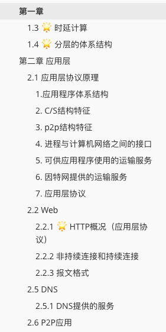
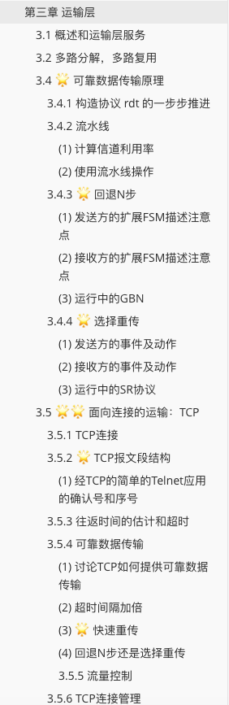
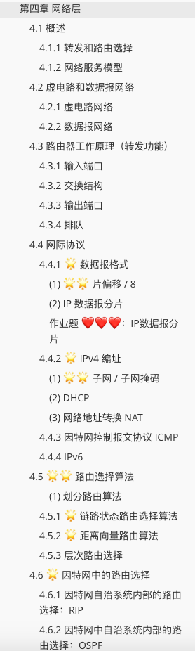

### 文件介绍

[计算机网络复习.md](https://github.com/podiumdesu/Network_100/blob/master/%E8%AE%A1%E7%AE%97%E6%9C%BA%E7%BD%91%E7%BB%9C%E5%A4%8D%E4%B9%A0.md) -- 复习大纲本体，包含计算机网络自顶向下方法前五章的（我认为的）重点内容。

[计算机网络复习大纲.md](https://github.com/podiumdesu/Network_100/blob/master/%E8%AE%A1%E7%AE%97%E6%9C%BA%E7%BD%91%E7%BB%9C%E5%A4%8D%E4%B9%A0%E5%A4%A7%E7%BA%B2.md) -- 期末考试重点范围（2016级华科计算机）

### 食用须知

#### 书本 📖 

* [计算机网络 - 自顶向下方法（第六版）](https://book.douban.com/subject/26176870/) 快买！
* 不推荐计算机网络（那本从OSI七层模型的物理层往上讲的，看的让我怀疑人生），刚接触的同学千万千万一定一定不要从物理层往上看。

#### 工具 🔧 推荐

* [Typera](https://typora.io/) 是本人曾使用过的md编辑器中最最最最最好用的👏💐

* 由于github的MD并不支持部分latex数学公式的显示，为了更好的阅读，请clone后，本地使用typera打开进行阅读

#### 教师 👨‍🏫 推荐

疯狂为我院[肖凌](http://faculty.hust.edu.cn/xiaoling3/zh_CN/jxzy/1732481/list/index.htm)老师打call👏👏，这门课我上的特别认真的最大原因就是因为老师上课真的太有意思了，完全没法走神hhhh。虽然最后考试有一丝遗憾没拿到心仪的分数，但是我在这个课堂上真的收获了远多于课本知识的东西。

因为iCloud某些备份的智障原因导致我原版pdf丢失，缺失内容为交换机自学习等内容，我会视心情决定什么时候把此复习文档补全。

> 注⚠️：本文档没有第六章无线网内容，请好好复习，考试要考。

> 注⚠️：计网实验我会视心情决定什么时候放上来 :<

### 附录

#### 复习大纲本体目录

目录展示：

