## 第一章

### 1.3 🌟 时延计算


1. 处理时延
2. 排队时延
   1. 在链路上等待传输时，经受 __排队时延__
3. 传播时延
   1. 先到先服务方式传输，传输时延是 L / R
   2. R (b/s) 表示从路由器A到路由器B的链路传输速率
   3. L (bit) 表示该分组的长度
4. 传输时延
   1. 从链路起点到路由器传播所需要的时间，取决于该链路的物理媒体
   2. d / s
   3. d : 路由器之间的距离
   4. s : 该链路的传播速率

作业题目：


### 1.4 🌟 分层的体系结构

1. 应用层
   * http
2. 运输层
   * tcp / ip
   * 可靠数据传输协议
3. 网络层
   * ip地址
   * 路由选择算法
4. 链路层
   * 多路访问链路和协议
   * 随机接入协议
   * ARP
5. 物理层


## 第二章 应用层

### 2.1 应用层协议原理

#### 1.应用程序体系结构

客户-服务器体系结构 / P2P体系结构

#### 2. C/S结构特征

* 具有固定的、周知的地址   -- ip地址

#### 3. p2p结构特征

* 自扩展性

#### 4. 进程与计算机网络之间的接口

1. 通过 __套接字__ 的软件接口向网络发送报文和从网络接收报文
2. 套接字是应用程序进程和运输层协议之间的接口
3. 套接字也成为应用程序和网络之间的应用程序编程接口
4. 使用IP地址标识主机，同时应当指定运行在接收主机上的接收进程（接收套接字）。一般使用 __目的地端口号__ 实现这个目的

#### 5. 可供应用程序使用的运输服务

一个运输层协议能够为调用它的应用程序提供什么样的服务呢？从四个方面对应用程序服务要求进行分类：可靠数据传输、吞吐量、定时、安全性

1. 可靠数据传输
   * 确保由应用程序一端发送的数据正确、完全地交付给该应用程序的另一端
   * 由运输层协议提供
   * 将数据传递给套接字之后就可以完全放心不用管啦
   * 当不提供可靠数据传输时，可能能被容忍丢失的应用所接受
2. 吞吐量
   * 可用吞吐量就是发送进程能够向接收进程交付比特的速率
3. 定时
4. 安全性
   * 运输协议能够加密由发送进程传输的所有数据

####  6. 因特网提供的运输服务

1. 因特网为应用程序提供两个运输层协议：TCP / UDP
2. TCP服务
   * 面向连接的服务（握手）
   * 可靠的数据传送服务
   * 具有拥塞控制机制
   * TCP安全性：使用 __安全套接字层__ ，在应用层上实现的加强。
   * 发送进程  ---(明文数据)--> SSL套接字 ---(加密数据)---> TCP套接字
3. UDP服务
   * 不提供不必要服务的轻量级协议
   * 无连接（不握手😢），不可靠🙅数据传送服务

#### 7. 应用层协议

如何构造报文？各个字段含义？何时发送报文？

__应用层协议__ 定义了运行在不同端系统上的应用程序进程如何相互传递报文

* 交换的报文类型
* 报文类型的语法
* 字段的语义
* 一个进程何时以及如何发送报文


### 2.2 Web

#### 2.2.1 🌟 HTTP概况（应用层协议）

1. http使用TCP作为支撑运输协议
2. http不保存关于客户的任何信息，是个无状态协议
3. Web使用了 C/S 应用程序体系结构

#### 2.2.2 非持续连接和持续连接

1. 持续连接：所有请求及其响应经相同的TCP链接发送

2. 非持续连接：请求/响应对 经一个单独的TCP连接发送

3. 端口号：80 🌟

4. 非持续连接情况下，从服务器向客户传送一个Web页面的步骤

   

5. 客户请求HTML基本文件起到客户收到整个文件所花费时间

   * 往返时间定义：一个短分组从客户到服务器然后再返回客户所花费的时间

     

6. 采用持续的连接

   * 为每一个请求的对象建立和维护一个全新的连接


#### 2.2.3 报文格式

两种报文：请求报文和响应报文

1. 请求报文

   

   * 第一行：请求行（方法字段，URL字段，HTTP版本字段）
   * 之后的行：首部行
     * Host：指明对象所在的主机
     * Connection: close，不用使用持续连接
     * User-agent：指明用户代理，向服务器发送请求的浏览器的类型
     * Accept-language：语言版本 / 默认版本

2. 响应报文

   

   * 初始状态行（协议版本字段，状态码，相关状态信息）
   * 首部行
     * Connection: close：发送完报文后会关闭连接
     * Date：指示服务器产生并发送该响应报文的日期和时间
     * Server：服务器类型
     * Last-Modified：最后修改时间
     * Content-Length：被发送对象中的字节数
     * Content-Type：实体对象类型
   * 实体体（报文的主要部分，包含了所请求的对象本身）

 

### 2.5 DNS

#### 2.5.1 DNS提供的服务


### 2.6 P2P应用

1. 基本工作机制
   * 向邻居请求哪些块（最稀罕优先）
   * 优先响应哪些请求（对换算法 4+1）
2. 对换算法
   * 每10秒确定前4个最高速率对等方
   * 每30秒随机选择一个新邻居


## 第三章 运输层

运输层位于应用层和网络层之间，该层为运行在不同主机上的应用进程提供直接的通信服务起着至关重要的作用。

功能：

* 将网络层的在两个端系统之间的交互服务扩展到运行在两个不同端系统上的应用层进程之间的交付服务。
* 两个实体如何在会丢失或者损坏数据的媒体上可靠地通信

### 3.1 概述和运输层服务

运输层协议是在端系统而不是在路由器中实现的。发送端将从应用程序进程接收到的报文转换成运输层分组（即为运输层报文段），然后将报文段交给网络层，网络层将其分装成网络层分组（即为数据报）并向目的地发送。

运输层协议：TCP（传输控制协议）， UDP（用户数据报协议）。

### 3.2 多路分解，多路复用

1. 将主机间交互扩展到进程间交付被称为运输层的多路分解和多路复用
2. 通过 __源端口号字段__和__目的端口号字段__ 实现运输层的分解服务，


3.3 无连接传输：UDP

1. 无拥塞控制
2. 无需建立连接
3. 无连接状态
4. 分组首部开销小


### 3.4 🌟 可靠数据传输原理

#### 3.4.1 构造协议 rdt 的一步步推进

1. rdt1.0

   

2. Rdt2.0

   * 使用了肯定确认和否定确认，基于这样重传机制的可靠数据传输协议称为自动重传请求（ARQ）协议
     * 差错检测（判断分组受损）
     * 接收方反馈（ACK / NAK）
     * 重传（收到有差错的分组）
   * __停等协议__
   * 使用序号保证应答正确

3. rdt3.0

   * 重传：倒计时定时器（比一个rtt长一点）
   * 检验和 
   * 序号
   * ACK

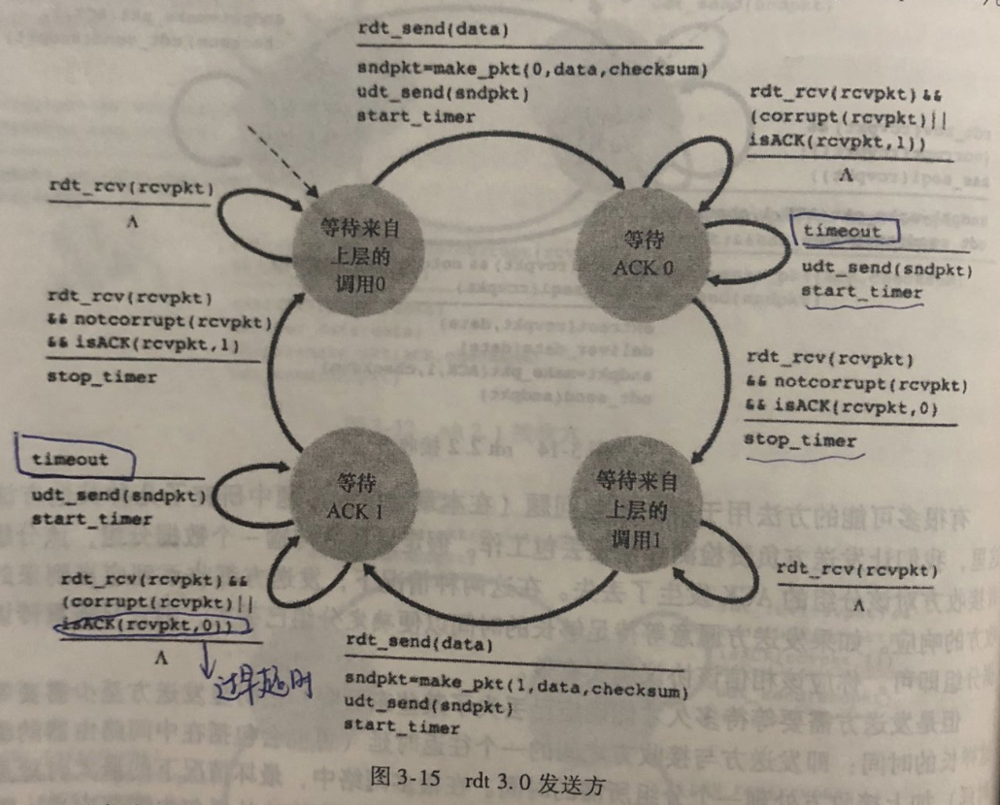

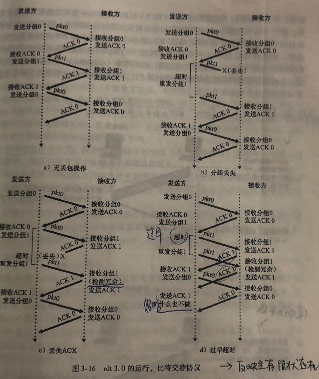


#### 3.4.2 流水线

##### (1) 计算信道利用率

发送方（信道）利用率：发送方实际忙于将发送比特送进信道的那部分时间与发送时间之比。

以停等操作的发送方利用率计算为例：


##### (2) 使用流水线操作

U = $(3 * L/R) / ( RTT + L / R ) $

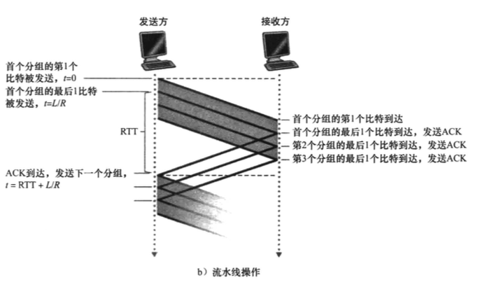


* 增加序号范围
* 也许需要缓存多个分组
* 解决流水线的差错恢复有两种基本方法：__回退N步__（GBN） 和 __选择重传__（SR）


#### 3.4.3 🌟 回退N步

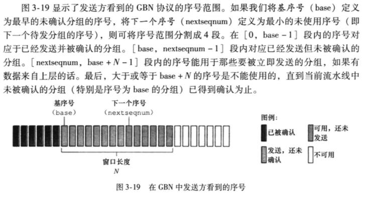

* N 窗口长度
* GBN协议：滑动窗口协议

##### (1) 发送方的扩展FSM描述注意点

1. 滑动窗口判断发送数据
   - 定时器在发送数据时只开启一个
2. 重启定时器的时机
   - 是否发出的数据全部收到ACK
3. 收到ACK的时候
   - 因为是按序，所以直接`base = getacknum(rcvpkt) + 1`
4. 超时
   - 只要超时，一定是base超时，直接重启定时器
   - 一下子将窗口里的所有数据重发


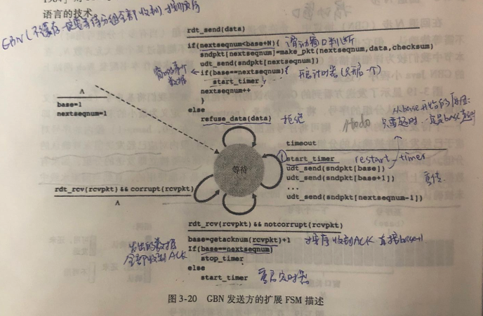


##### (2) 接收方的扩展FSM描述注意点

1. 收到报文需要进行报文检验
   * 出错直接发送回应
2. 收到报文时检查序号
   * 序号不正确直接退回
   * 否则返回ACK（累计确认返回已正确收到的序号的最大值），将本地的expectedseqnum++
3. 采用 🌟__累计确认__ 的方式，表示接收方已经正确收到序号为n的以前且包括 n 在内的所有分组

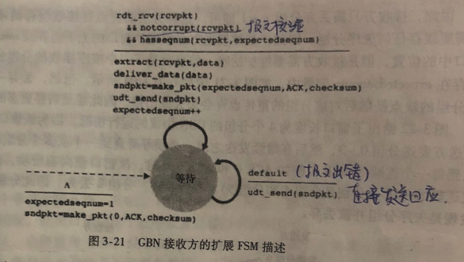


##### (3) 运行中的GBN

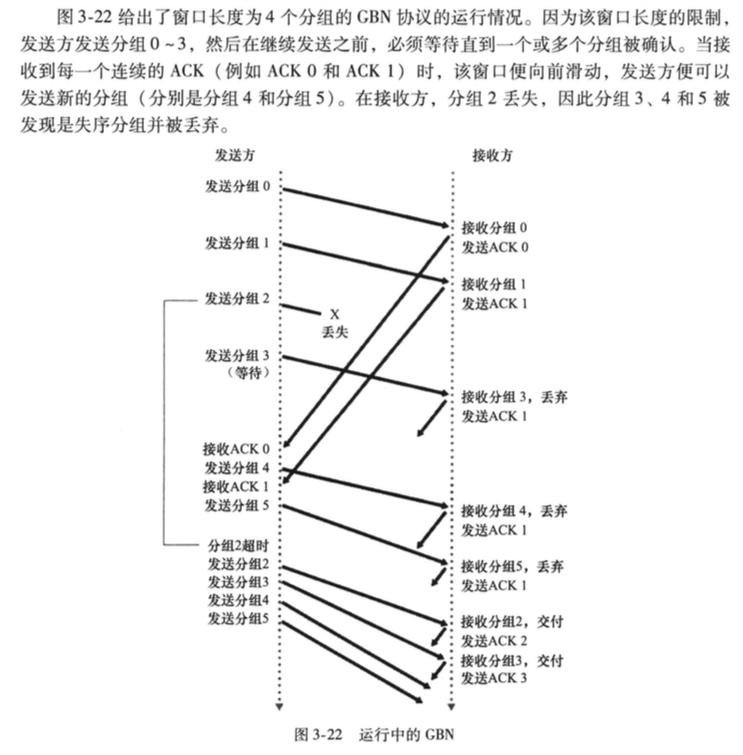


#### 3.4.4 🌟 选择重传

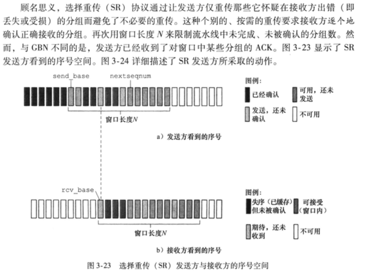

##### (1) 发送方的事件及动作

1. 超时
   * 每个分组拥有其自己的定时器
2. 收到ACK
   * 如果在窗口内，则将那个确认的分组标记为已接收
   * 如果序号 = send_base，则将窗口基序号移动到后面的最小序号处。
   * 如果窗口移动了并且有序号落在窗口内的未发送分组，则发送

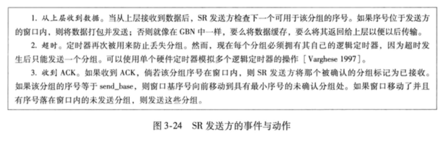

##### (2) 接收方的事件及动作

1. 失序的分组将被缓存知道所有丢失分组（比序号更小的分组）皆被收到为止

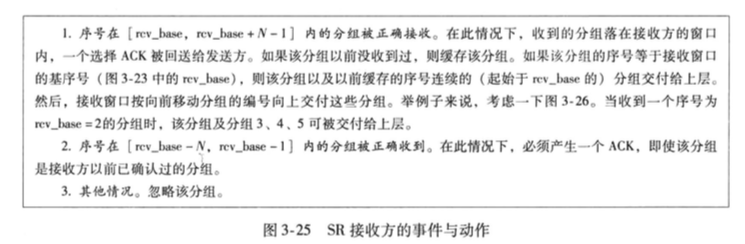

##### (3) 运行中的SR协议


### 3.5 🌟🌟 面向连接的运输：TCP

#### 3.5.1 TCP连接

1. 面向连接，两个进程必须先相互 “握手” 🤝

   * 三次握手

     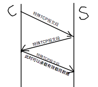

   * 协商

     * x, y
     * MSS
     * 分配资源

2. 提供全双工服务，点对点

3. MSS：最大报文段长度

4. MTU：最大传输单元

5. 当TCP为每块客户数据配上一个TCP首部时，形成了多个TCP报文段


#### 3.5.2 🌟 TCP报文段结构

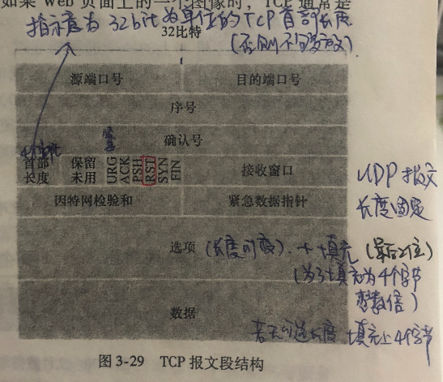

1. `16bit`源端口号/`16bit`目的端口号
   * 用于多路分解/复用
2. `32bit` 序号，用于实现可靠数据传输服务
3. `32bit` 确认号，用于实现可靠数据传输服务
4. `4bit` 的首部长度 + 保留未用的 6bit 数据
5. `6bit` 的标志字段
6. `16bit` 接收窗口字段，用于指示接收方愿意接受的字节数量
7. 检验和 + 紧急数据指针
8. 可选和变长的`选项字段`，一般用于双方协商最大报文段长度（MSS）时使用
   * 长度可变 + 填充（最后两位）为了填充为4个字节


##### (1) 经TCP的简单的Telnet应用的确认号和序号

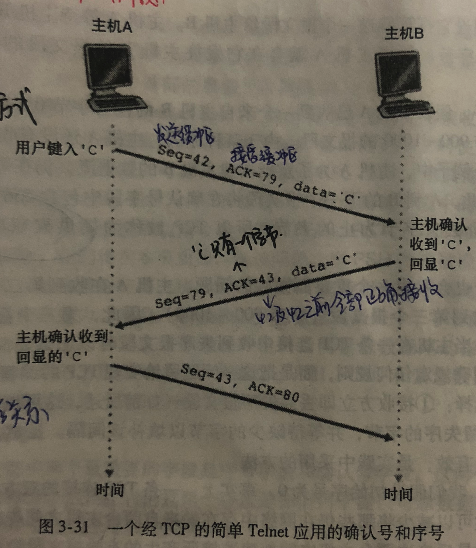

* 需要计算数据长度

#### 3.5.3 往返时间的估计和超时

1. 估计往返时间

   * 首先计算 EstimatedRTT

   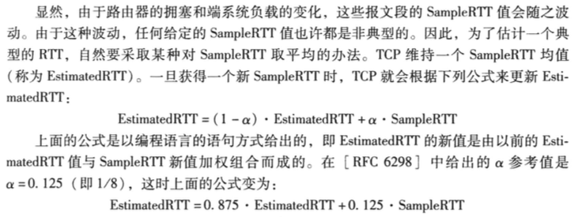

   * 计算DevRTT， 的推荐值 = 0.25

   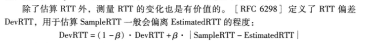

   * 计算重传超时间隔
     * TimeoutInterval = EstimatedRTT + 4 * DevRTT

#### 3.5.4 可靠数据传输

##### (1) 讨论TCP如何提供可靠数据传输

三个与发送和重传的主要事件：

1. 从上层应用数据接收数据
2. 定时器超时（过期间隔是TimeoutInterval）
3. 收到ACK
   * 将ACK的`y` 值与`sendBase`进行比较。sendBase是最早未被确认的字节的序号。确认号代表期望收到的下一个序号，且之前所有数据均被接收

简化的TCP发送方

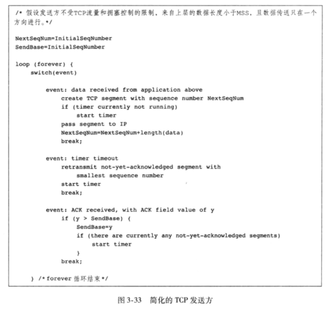

##### (2) 超时间隔加倍

每次TCP重传时都会将下一次的超时间隔设为先前值的两倍，而不是TimeoutInterval。

但是当正常情况下只会是TimeoutInterval

##### (3) 🌟 快速重传

通过重复的ACK检测丢失报文段


如果TCP发送方接收到对相同数据的3个冗余ACK，就立刻执行快速重传。

##### (4) 回退N步还是选择重传

更像是二者的结合体


##### 3.5.5 流量控制

流量控制服务：用于消除发送方使接收方缓存溢出的可能性。

流量控制是一个速度匹配服务，即发送方的发送速率与接收方的应用程序的读取速率相匹配。

1. 发送方维持一个 __接收窗口__的变量来提供流量控制。
2. TCP提供流量控制，但是UDP并不提供哦🙅


#### 3.5.6 TCP连接管理

1. TCP三次握手的报文段交换

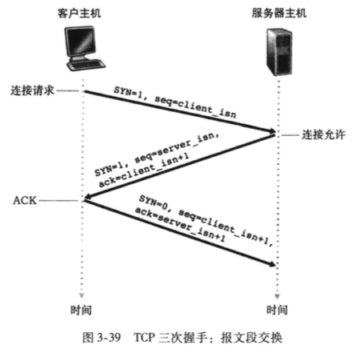


### 3.6 拥塞控制

过多的源发送了过多的数据


### 3.7 🌟🌟 TCP拥塞控制

##### (1) 慢启动（无历史信息）

1. cwnd的值通常设置为一个MSS的较小值
2. 初始发送速率大约为 $ MSS / RTT $


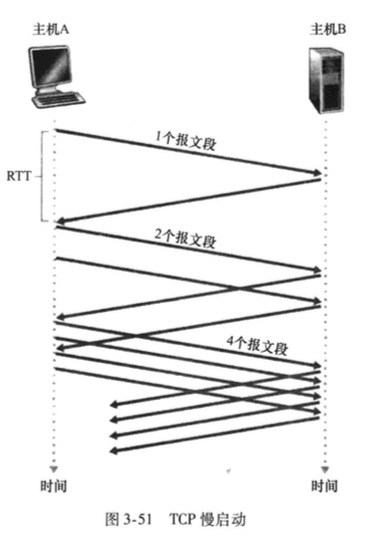

* 慢启动状态下，每经过一个RTT，发送速率翻番。


⚠️⚠️ 何时结束这种指数级增长❓

1. 存在一个由超时知识的丢包事件（拥塞），cwnd设置为1，同时重新开始慢启动。而同时将阈值`ssthresh` 设置为 `cwnd / 2`。

   ```
   ssthresh = cwnd / 2
   cwnd = 1 MSS
   ```

2. 当cwnd的值 等于 `ssthresh` 时，结束慢启动并且TCP转移到拥塞避免模式

3. 检测到 3 个冗余ACK，执行一种快速重传。此时判定为丢了 -> `ssthresh` 设为 `cwnd / 2 ` ，`cwnd` 设为 ` ssthresh 再加 3 个MSS` -> 线性增大

   ```
   ssthresh = cwnd / 2
   cwnd = ssthresh + 3MSS
   ```

##### (2) 🌟 拥塞避免

进入拥塞避免时，开始 `线性` 增长 ❗️

何时结束呢❓

1. 当出现超时时
   * cwnd = 1 MSS
2. 当出现丢包
   * ssthresh = cwnd / 2
   * cwnd = ssthresh + 3


##### (3) 🌟 快速恢复

1. Tahoe：
   * 无论发生超时的丢包 还是 3个冗余ACK的丢包，统统无条件地将cwnd减为1个MSS，并进入慢启动阶段
2. Reno版本：

两种版本不同的拥塞窗口的变化

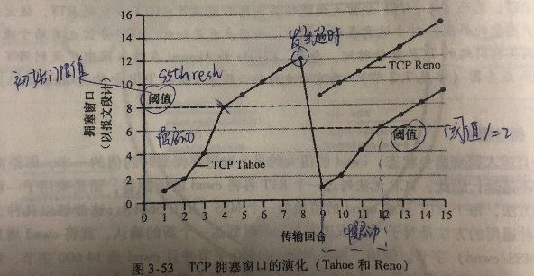


#####  作业题 ❤️❤️❤️ Reno / Tahoe

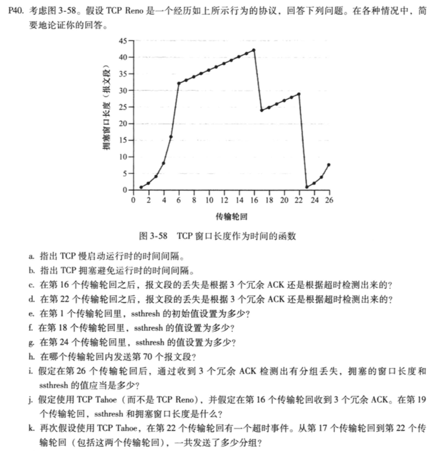

1. 慢启动： [ 1, 6 ], [ 23, 26 ]
2. 拥塞避免运行：[ 6, 16 ], [ 17, 22] 
3. 第 16 个后，报文段的丢失是 3 个冗余ACK
4. 第 22 个后，报文段的丢失是超时
5. 第1 个中，ssthresh = 32
6. 第 18 个中，ssthresh = 42 / 2 = 21 （❗️3个冗余ACK导致的应该是cwnd / 2）
7. 第 24 个中，ssthresh = 29 / 2 = 14 （❗️超时导致的也是 cwnd / 2）
8. 第 70 个报文段 ：第7个
9. 3个冗余ACK：ssthresh = 8 / 2 = 4，cwnd = 4 + 3 = 7
10. 使用 Tahoe（❗️无论什么原因都直接从头开始，ssthresh = cwnd / 2），16收到了3个冗余ACK，cwnd = 4 
11. 请注意新的阈值


##### (4) TCP拥塞控制：回顾

1. 每个RTT内cwnd线性增加，出现3个冗余ACK后，cwnd减半。
2. 加性增，乘性减 的拥塞控制方式

##### (5) 吞吐量

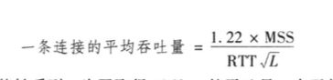


## 第四章 网络层

网络层是如何实现主机到主机的通信服务。

主要内容：

1. 分组转发
2. 路由选择
3. ipv4
4. IP
5. NAT
6. 数据报分段（网络地址转换）
7. 因特网控制报文协议

三个组件：

1. IP协议
2. 因特网路由选择协议（RIP, OSPF, BGP）
3. 因特网控制报文协议（ICMP）

### 4.1 概述

#### 4.1.1 转发和路由选择

1. 网络层功能

   * 转发（分组到达路由器的一条输入链路时，路由器必须将分组移动到适当的输出链路）
   * 路由选择（分组从发送方流向接收方时，网络层必须决定这些分组所采用的路由或路径。计算路径的算法成为__路由选择算法__

2. 每台路由器具有一张转发表，通过检查到达分组首部字段的值来转发分组，使用该值在该路由器的转发表中索引查询。

   * 检查到达分组首部字段的值
   * 查找本地转发表
   * 获得输出链路端口

   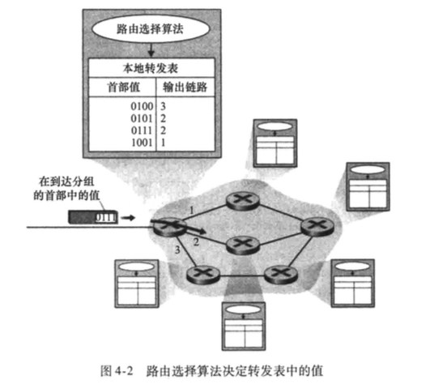

3. 路由选择算法决定了插入路由器的转发表中的值

4. 分组交换机 是指一台通用分组交换设备，它根据分组首部字段中的值，从输入链路接口到输出链路接口转移分组。某些分组交换机成为链路层交换机，根据链路层字段中的值做转发决定。其他分组交换机成为路由器，基于网络层字段中的值做转发决定。

5. 连接建立


#### 4.1.2 网络服务模型

### 4.2 虚电路和数据报网络

仅在网络层提供连接服务的计算机网络称为虚电路网络（VC网络）

仅在网络层提供无连接服务的计算机网络称为数据报网络

#### 4.2.1 虚电路网络

#### 4.2.2 数据报网络

当有多个匹配时，路由器使用最长前缀匹配规则


### 4.3 路由器工作原理（转发功能）

路由器的4个组成部分：

1. 输入端口
2. 交换结构
3. 输出端口
4. 路由选择处理器

#### 4.3.1 输入端口

1. 通过使用转发表来查找输出端口。

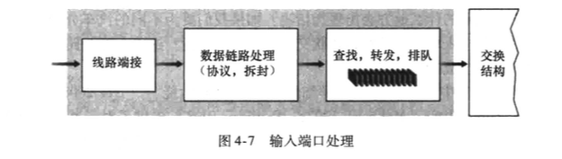

防火墙是一种过滤所选择的入分组的设备

#### 4.3.2 交换结构

有三种交换技术：

1. 经内存交换
2. 经总线交换
3. 经互联网络交换


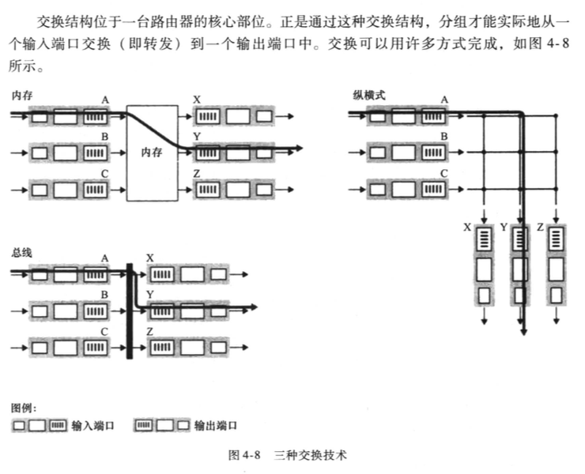

#### 4.3.3 输出端口

输出端口处理取出存放在输出端口内存中的分组并将其发送到输出链路上。这包括选择和取出排队的分组进行传输，执行所需的链路层和物理层传输功能。

#### 4.3.4 排队

$ B = RTT * \cfrac{ C } { \sqrt{n} } $


### 4.4 网际协议


#### 4.4.1 🌟 数据报格式

网络层分组被称为数据报

IPv4的数据报格式如下所示：

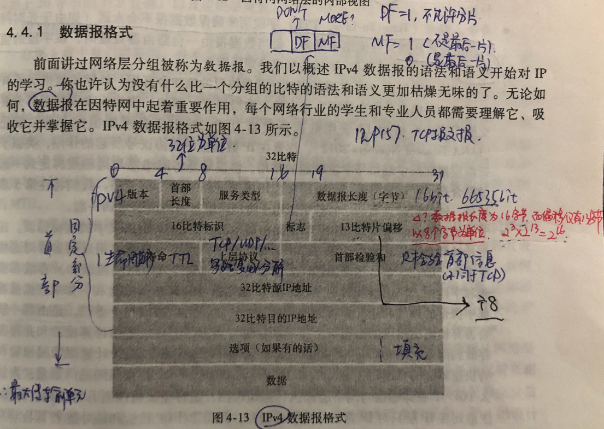

##### (1) 🌟🌟 片偏移 / 8

请注意此处的片偏移为13bit，那么如何存放的下16bit长度，1字节为单位，共 $2 ^ {16}$ 字

节。但片偏移只有13bit，如何完成呢？

🌟🌟 片位移以8字节为单位，这样 $2 ^ 3 * 2 ^ {13}= 2 ^ {16}  $


##### (2) IP 数据报分片

1. 一个链路层帧能承载的最大数据量叫做 __最大传送单元 MSS__。
2. 每条连路上的链路层协议规定的MTU可能不同，如何将过大的IP分组压缩进链路层帧的有效载荷字段呢？
   * 解决方式是：将IP数据报中的数据分片分成两个或更多个较小的IP数据包。
   * 使用 标志位bit 判断是否是最后一位bit，（DF / MF）。使用偏移字段指定该片应放在初始IP数据报的哪个位置

##### 作业题 ❤️❤️❤️：IP数据报分片

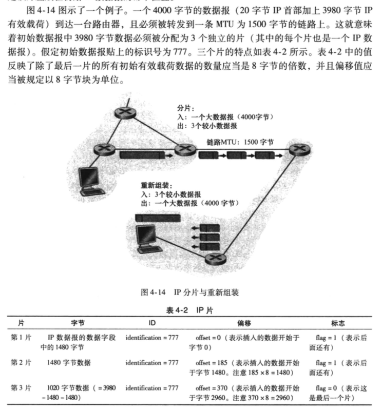


#### 4.4.2 🌟 IPv4 编址

1. IP地址使用点分十进制记法进行书写。
2. ⚠️⚠️：不在同一个网络不能用相同的网络号

##### (1)  🌟🌟 子网 / 子网掩码

把网络中的主机号再分出N位作为网络号，这样可以分出更小的网络。

主机号为全 0 的地址  - 网络地址

主机号为全 1 的地址  - 广播地址

因特网的地址分配策略被称为 __无类别域间路由选择__

##### (2) DHCP

动态主机配置协议

自动分配一个IP地址。8

##### (3) 网络地址转换 NAT

1. NAT使路由器对外界隐藏了家庭网络的细节

2. 路由器怎么知道应将某个分组转发给哪个内部主机呢？ （使用NAT转发表）

   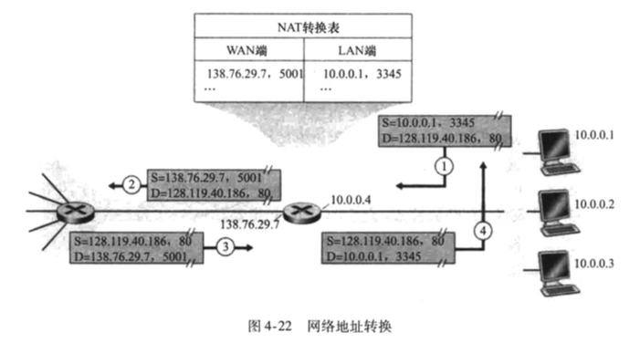

   * 会记录 LAN 端的ip地址和端口号，然后分配一个 WAN 端 的ip地址和端口号，放入NAT中

      

#### 4.4.3 因特网控制报文协议 ICMP

1. 用于被主机和路由器以及网关之间彼此沟通网络层信息的协议。
2. 典型用途是 __差错报告__ 。

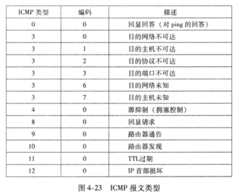

#### 4.4.4 IPv6

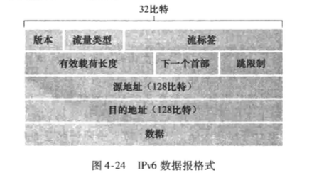

首部数据长度固定

而IPv4中的 __分片/组装__ 、__首部检验和__ 、 __选项字段__ 已经不复存在


### 4.5 🌟🌟 路由选择算法

用图来形式化描述路由选择问题

##### (1) 划分路由算法

1. 按照广义分类方式：
   * 全局式：以完整的、全局性的网络制式计算出从源到目的地之间的最低费用路径。实践中，具有全局状态信息的算法常被称作 __链路状态算法__
     * Dijkstra / OSPF
   * 分散式：以迭代、分布式的方式计算出最短费用路径。没有结点拥有关于所有网络链路费用的完整信息。__距离向量算法__的分布式路由选择算法。每个结点维护到网络中所有其他结点费用估计的向量
     * RIP
2. 按照静态还是动态
   * 静态路由选择算法：路由变化缓慢
   * 动态路由选择算法：可周期性地运行或直接响应拓扑或链路费用的变化而变化
3. 按照负载敏感还是负载迟钝
   * 负载敏感：链路费用会动态地变化
   * 负载迟钝：某条链路的费用不明显地反应其当前的拥塞水平

#### 4.5.1 🌟 链路状态路由选择算法

Dijkstra算法，计算从某节点到网络中所有其他结点的最低费用路径

OSPF是全网的拓扑结构图


#### 4.5.2 🌟 距离向量路由算法

距离向量（DV）算法是一种迭代的、异步的、分布式的算法

该最低费用与著名的Bellman-Ford方程相关

$$d_x(y) = min_v\{ c(x, v) + d_v(y) \}$$


#### 4.5.3 层次路由选择

网关路由器。


### 4.6 🌟 因特网中的路由选择

AS内部路由选择协议有称为内部网关协议。

历史上有两个路由选择协议非常广泛地运用在因特网上自治系统内的路由选择：路由选择信息协议（Routing Information Protocol）和 开放最短路优先（Open Shortest Path First, OSPF）

#### 4.6.1 因特网自治系统内部的路由选择：RIP

1. RIP使用跳数作为其费用测度。
2. RIP使用限制在网络直径不超过15跳的自治系统内。
3. 路由选择更新信息在邻居之间是通过一种__RIP响应报文__来交换。
4. 每台路由器维护一张称为__路由选择表__的RIP表。
5. 心跳探测：180秒


#### 4.6.2 因特网中自治系统内部的路由选择：OSPF

1. 使用洪泛链路状态信息的链路状态协议和一个Dijkstra最低费用路径算法
2. OSPF，路由器构造了一幅关于整个自治系统的完整脱去图。在本地运行Dijkstra，以确定一个以自身为根节点的到所有子网的最短路径树。

优点：

1. 安全
2. 多条相同费用的路径
3. 对单播和多播路由选择的总和支持
4. 支持在单个路由选择域内的层次结构


## 第五章：链路层


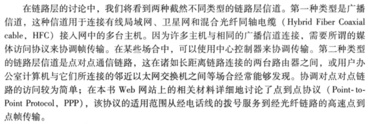

### 5.1 链路层概述

#### 5.1.1 提供的服务

1. 成帧，帧的结构由链路层协议规定。（封装和解封装）
2. 链路接入
   * MAC（媒体访问控制）协议规定了帧在链路上的传输规则。
3. 可靠交付
   * 用于易于产生高差错率的链路
   * 链路层的可靠交付通常是通过确认和重传取得的（参见3.4节）
4. 差错检测和纠正
   * 通过硬件实现


链路层的主体部分是在网络适配器中实现的，就是一般称为的网络接口卡（NIC），位于网络适配器核心的是链路层控制器，该控制器是一个实现了许多链路层服务（成帧、链路接入、差错检测）的专用芯片。

而应用层的主体部分是在应用程序中实现的，网络层和运输层的主体部分是在操作系统上实现的，链路层就是在NIC上实现的。

### 5.2 差错检测和纠正技术

#### 5.2.1 奇偶校验

#### 5.2.2 检验和方法

#### 5.2.3 CRC检测


### 5.3 多路访问链路和协议

两种类型的网络链路：点对点链路（单个发送方单个接收方） 和 广播链路 👏

如何协调多个发送和接收节点对一个共享广播信道的访问❓

1. 使用多路访问协议

   * 信道划分协议
   * 随机接入协议
   * 轮流协议

2. 特点

   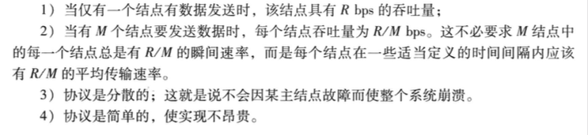

#### 5.3.1 信道划分协议

__时分复用__ 和  __频分复用__ 是两种能够用于在所有共享信道结点之间划分广播信道带宽的技术。

##### (1) TDM

1. 划分成时间帧
2. R / N 的带宽

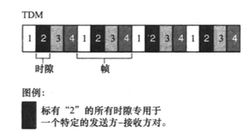


##### (2) FDM

1.  划分为不同的频段
2. 但是限制了一个结点只能使用 R / N 的带宽

##### (3) CDMA （码分多址）

1. 对每个结点分配一种不同的编码，使用唯一的编码来对它发送的数据进行编码。
2. 不同的结点能够同时传输 😊


### 5.3.2 🌟 随机接入协议（如何检测碰撞以及如何恢复）


随机接入协议中，一个传输结点总是以新到的全部速率进行发送，当有碰撞时，涉及碰撞的每个结点独立地选择随机时延。

要求各个结点同步它们的传输，以在每个时隙开始时开始传输。

##### (1) 时隙 ALOHA

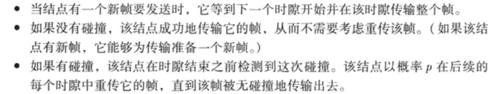

1. 与信道划分不同，当某结点是唯一活跃的结点时，允许该节点以全速R连续传输。
2. 刚好有一个结点传输的时隙称为一个成功时隙。

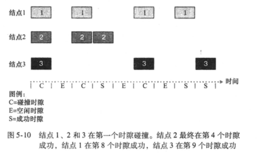

__效率__：

$$ P_{成功} = N * p * (1-p) ^ {N - 1}$$


##### (2) ALOHA

在纯ALOHA中，当一帧首次到达，结点立刻将该帧完整地传输进广播信道。

$$P_{成功} = p * ( 1 -p ) ^ {2 * ( N - 1 ) }$$

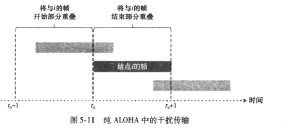

##### (3) 载波侦听多路访问（CSMA）

规则：

1. 说话之前先听。__载波侦听__

广播信道的端到端__信道传播时延__ 在决定其性能方面起着关键的作用。

该传播时延越长，载波侦听结点不能侦听到网络中另一个结点已经开始传输的机会就越大。


##### (4) 具有碰撞检测的载波侦听多路访问（CSMA / CD） 

规则：

1. 如果与他人同时开始说话，停止说话。__碰撞检测__


等待一个随机的时间量。

$$效率 = \cfrac{1} {1 + \cfrac{5d_{prop}}{d_{trans}}}$$


#### 5.3.3 轮流协议

1. 轮询协议

   * 设置一个主结点进行轮询

   * 消除了困扰随机接入协议的碰撞和空时隙。
   * 但引入了轮询时延
   * 主结点故障会导致整个信道不可操作

2. 令牌传递协议

   * 使用token
   * 当收到令牌时，仅当它有帧要发送时，它才持有灵牌。
   * 一个结点的故障可能导致崩溃
   * 一个结点忘记释放令牌

### 5.4 交换局域网

#### 5.4.1 链路层寻址和ARP

##### (1) MAC地址

并不是主机或路由器具有链路层地址，而是它们的适配器（网络接口）具有链路层地址。

>  不同叫法有：LAN地址，物理地址，MAC地址


当某适配器要向某些目的适配器发送一个帧时，发送适配器将目的适配器的MAC地址插入到该帧中，并将该帧发送到局域网上。

当适配器收到一个帧的时候，将检查该帧的目的MAC地址是否与自己的MAC地址匹配，如果匹配，则提取出封装的数据，沿着协议栈向上传递。否则丢弃该帧。


##### (2) 🌟🌟 地址解析协议（Address Resolution Protocol）

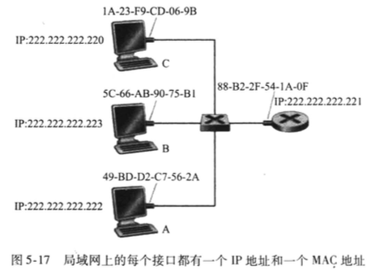

假设IP地址 222.222.222.220向222.222.222.220发送IP数据报，如何确定目的主机的MAC地址呢？

> 使用ARP将IP地址转换为MAC地址。

⚠️⚠️  ARP只为在同一个子网上的主机和路由器接口解析IP地址。

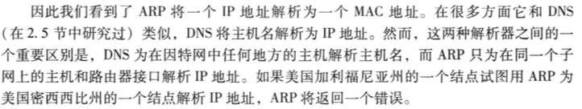

 ARP表内包含IP地址到MAC地址的映射关系。

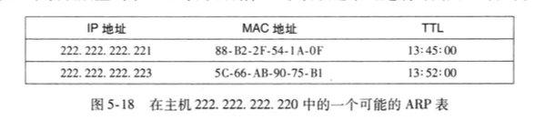

TTL是过期时间，指示了从表中删除每个映射的时间。


> 但是如果表中没有对应的映射关系呢？

使用ARP协议来解析这个地址❗️

1. 构造一个ARP packet的特殊分组。
   * 发送和接收IP地址和MAC地址
2. 向适配器传递一个ARP查询分组，并且指示适配器应该用MAC广播地址（FF-FF-FF-FF-FF-FF）来发送这个分组。
3. 适配器在链路层帧中封装这个ARP分组，用广播地址作为帧的目的地址，并将该帧传输进子网中。
4. 子网上所有其他当适配器接收到，并将该帧中的ARP分组向上传递给ARP模块。__检查自己的IP地址是否与ARP分组中的目的IP地址相匹配__
5. 如果匹配的话，给查询主机发送回一个带有所希望映射的响应ARP分组
6. 这样查询主机能够更新它的ARP表，并发送它的IP数据包。


##### (3) 🌟🌟 发送数据报到子网以外

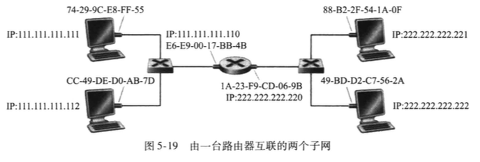

注意：

1. 路由器的每个接口都有一个ARP模型和一个适配器。
2. 路由器的每个接口都有一个IP地址。

3. 每台主机仅有一个IP地址和一个适配器。（每个适配器都有自己的MAC地址）


#### test

#### test