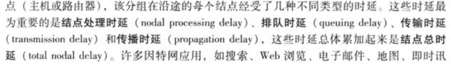
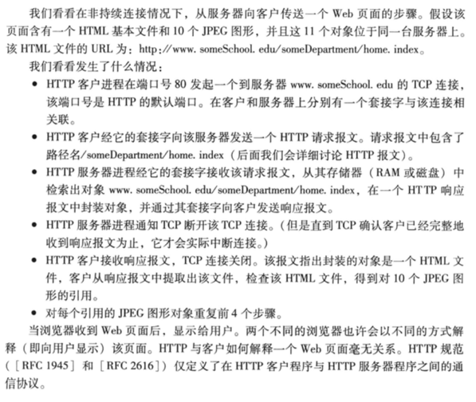
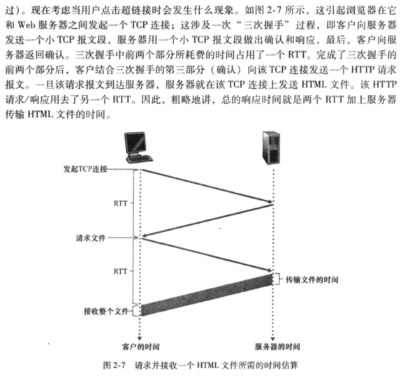
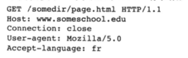
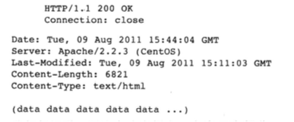
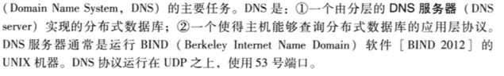
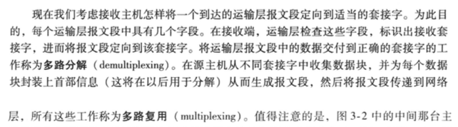
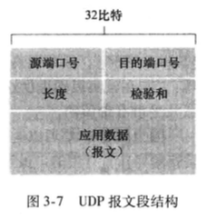
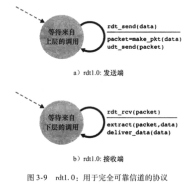

## 第一章

### 1.3 🌟 时延计算

1. 处理时延
2. 排队时延
   1. 在链路上等待传输时，经受 __排队时延__
3. 传播时延
   1. 先到先服务方式传输，传输时延是 L / R
   2. R (b/s) 表示从路由器A到路由器B的链路传输速率
   3. L (bit) 表示该分组的长度
4. 传输时延
   1. 从链路起点到路由器传播所需要的时间，取决于该链路的物理媒体
   2. d / s
   3. d : 路由器之间的距离
   4. s : 该链路的传播速率

作业题目：

### 1.4 🌟 分层的体系结构

1. 应用层
   * http
2. 运输层
   * tcp / ip
   * 可靠数据传输协议
3. 网络层
   * ip地址
   * 路由选择算法
4. 链路层
   * 多路访问链路和协议
   * 随机接入协议
   * ARP
5. 物理层

## 第二章 应用层

### 2.1 应用层协议原理

#### 1.应用程序体系结构

客户-服务器体系结构 / P2P体系结构

#### 2. C/S结构特征

* 具有固定的、周知的地址   -- ip地址

#### 3. p2p结构特征

* 自扩展性

#### 4. 进程与计算机网络之间的接口

1. 通过 __套接字__ 的软件接口向网络发送报文和从网络接收报文
2. 套接字是应用程序进程和运输层协议之间的接口
3. 套接字也成为应用程序和网络之间的应用程序编程接口
4. 使用IP地址标识主机，同时应当指定运行在接收主机上的接收进程（接收套接字）。一般使用 __目的地端口号__ 实现这个目的

#### 5. 可供应用程序使用的运输服务

一个运输层协议能够为调用它的应用程序提供什么样的服务呢？从四个方面对应用程序服务要求进行分类：可靠数据传输、吞吐量、定时、安全性

1. 可靠数据传输
   * 确保由应用程序一端发送的数据正确、完全地交付给该应用程序的另一端
   * 由运输层协议提供
   * 将数据传递给套接字之后就可以完全放心不用管啦
   * 当不提供可靠数据传输时，可能能被容忍丢失的应用所接受
2. 吞吐量
   * 可用吞吐量就是发送进程能够向接收进程交付比特的速率
3. 定时
4. 安全性
   * 运输协议能够加密由发送进程传输的所有数据

####  6. 因特网提供的运输服务

1. 因特网为应用程序提供两个运输层协议：TCP / UDP
2. TCP服务
   * 面向连接的服务（握手）
   * 可靠的数据传送服务
   * 具有拥塞控制机制
   * TCP安全性：使用 __安全套接字层__ ，在应用层上实现的加强。
   * 发送进程  ---(明文数据)--> SSL套接字 ---(加密数据)---> TCP套接字
3. UDP服务
   * 不提供不必要服务的轻量级协议
   * 无连接（不握手😢），不可靠🙅数据传送服务

#### 7. 应用层协议

如何构造报文？各个字段含义？何时发送报文？

__应用层协议__ 定义了运行在不同端系统上的应用程序进程如何相互传递报文

* 交换的报文类型
* 报文类型的语法
* 字段的语义
* 一个进程何时以及如何发送报文

### 2.2 Web

#### 2.2.1 🌟 HTTP概况（应用层协议）

1. http使用TCP作为支撑运输协议
2. http不保存关于客户的任何信息，是个无状态协议
3. Web使用了 C/S 应用程序体系结构

#### 2.2.2 非持续连接和持续连接

1. 持续连接：所有请求及其响应经相同的TCP链接发送

2. 非持续连接：请求/响应对 经一个单独的TCP连接发送

3. 端口号：80 🌟

4. 非持续连接情况下，从服务器向客户传送一个Web页面的步骤

   

5. 客户请求HTML基本文件起到客户收到整个文件所花费时间

   * 往返时间定义：一个短分组从客户到服务器然后再返回客户所花费的时间

     

6. 采用持续的连接

   * 为每一个请求的对象建立和维护一个全新的连接

#### 2.2.3 报文格式

两种报文：请求报文和响应报文

1. 请求报文

   

   * 第一行：请求行（方法字段，URL字段，HTTP版本字段）
   * 之后的行：首部行
     * Host：指明对象所在的主机
     * Connection: close，不用使用持续连接
     * User-agent：指明用户代理，向服务器发送请求的浏览器的类型
     * Accept-language：语言版本 / 默认版本

2. 响应报文

   

   * 初始状态行（协议版本字段，状态码，相关状态信息）
   * 首部行
     * Connection: close：发送完报文后会关闭连接
     * Date：指示服务器产生并发送该响应报文的日期和时间
     * Server：服务器类型
     * Last-Modified：最后修改时间
     * Content-Length：被发送对象中的字节数
     * Content-Type：实体对象类型
   * 实体体（报文的主要部分，包含了所请求的对象本身）

 

### 2.5 DNS

#### 2.5.1 DNS提供的服务

### 2.6 P2P应用

1. 基本工作机制
   * 向邻居请求哪些块（最稀罕优先）
   * 优先响应哪些请求（对换算法 4+1）
2. 对换算法
   * 每10秒确定前4个最高速率对等方
   * 每30秒随机选择一个新邻居

## 第三章 运输层

运输层位于应用层和网络层之间，该层为运行在不同主机上的应用进程提供直接的通信服务起着至关重要的作用。

功能：

* 将网络层的在两个端系统之间的交互服务扩展到运行在两个不同端系统上的应用层进程之间的交付服务。
* 两个实体如何在会丢失或者损坏数据的媒体上可靠地通信

### 3.1 概述和运输层服务

运输层协议是在端系统而不是在路由器中实现的。发送端将从应用程序进程接收到的报文转换成运输层分组（即为运输层报文段），然后将报文段交给网络层，网络层将其分装成网络层分组（即为数据报）并向目的地发送。

运输层协议：TCP（传输控制协议）， UDP（用户数据报协议）。

### 3.2 多路分解，多路复用

1. 将主机间交互扩展到进程间交付被称为运输层的多路分解和多路复用
2. 通过 __源端口号字段__和__目的端口号字段__ 实现运输层的分解服务，

3.3 无连接传输：UDP

1. 无拥塞控制
2. 无需建立连接
3. 无连接状态
4. 分组首部开销小

### 3.4 🌟 可靠数据传输原理

#### 3.4.1 构造协议

1. rdt1.0

   

2. Rdt2.0

3. 

## 考试重点大纲

### 无敌重点：

1. 链路选路算法（距离向量，链路状态）
2. 子网划分（掩网）
3. ip分片、重组（年年都考）
4. 拥塞控制（原理）多少个rtt后窗口如何变化
5. 可靠传输原理
6. 实验上的cpt实验（网关啥的）

### 第一章重点

1. 时延
2. 体系结构

### 第二章 应用层

1. 80端口，http，p2p介绍过（一分选择题？填空题？）

### 第三章

1. tcp
   1. 建连接/拆连接/拥塞控制
2. 可靠
   1. 选择重传
   2. gbn

### 第四章

1. ip地址
   1. 子网划分、子网掩码
   2. ip报文格式、分片（片位移 / 8，为什么除以8！！肯定要考）、重组
2. 选路协议
   1. 链路状态
   2. 距离向量
3. rip / ospf
   1. 距离向量算法的延伸
   2. 应用

### 第五章

1. ARP
2. 随机访问控制协议
   1. CSMA / 时分alha
   2. CSMA/CA 、 CSMA/CD
3. 轮流协议 / 信道划分考的相对就少一点
4. 具体到局域网
   1. mac地址
   2. mac帧结构
   3. 以太网传输方式
   4. 指数回退算法
   5. 集线器 / 交换机 优点、特点（我只说重点、可没说这些都考）

### 第六章

1. 没重点
2. 刚讲的就是重点

一、单项选择 20题/1分

二、填空题 10题/1分

三、判断题 10题/1分

四、综合题 5题/12分 还是6题10分 没听清

